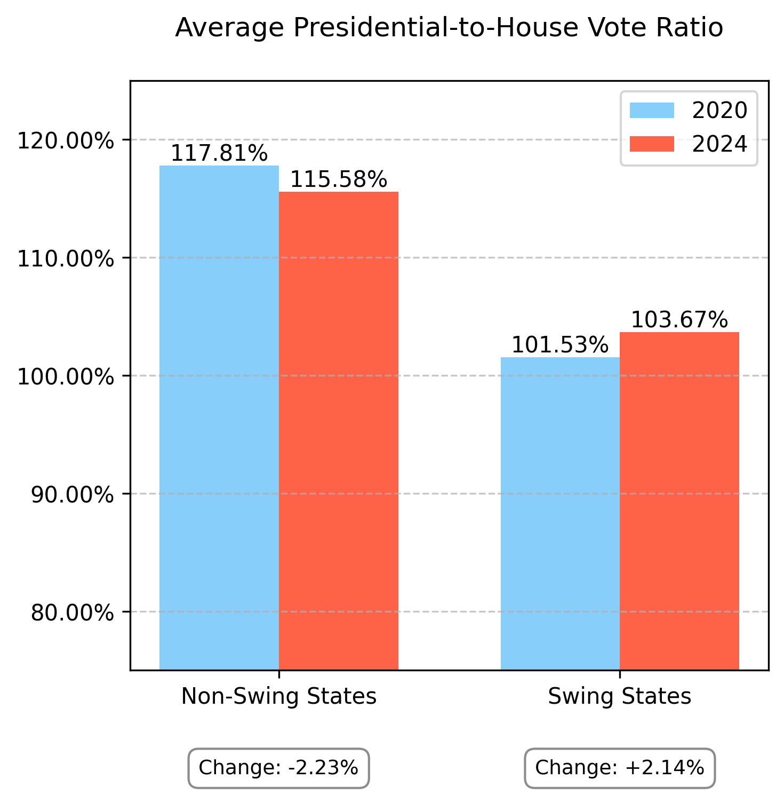
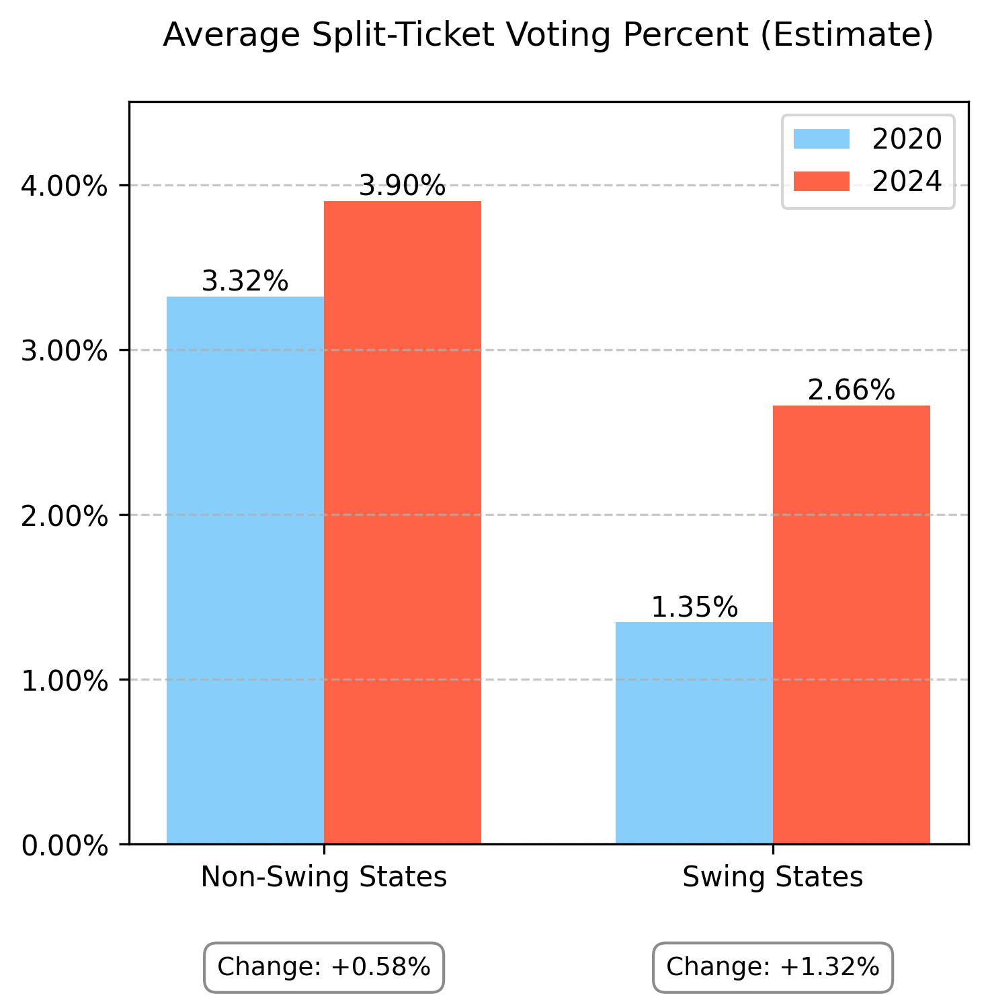
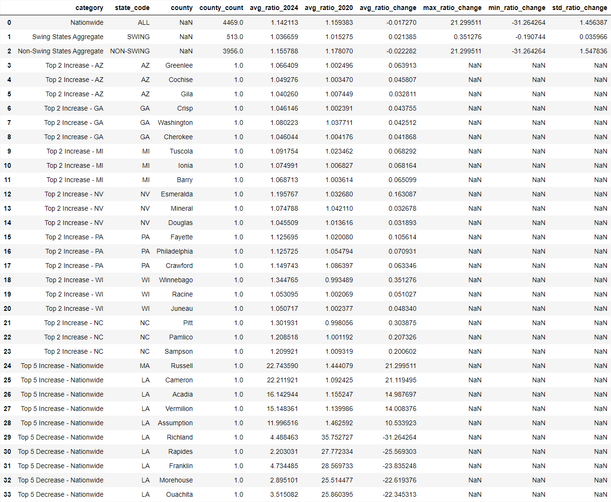
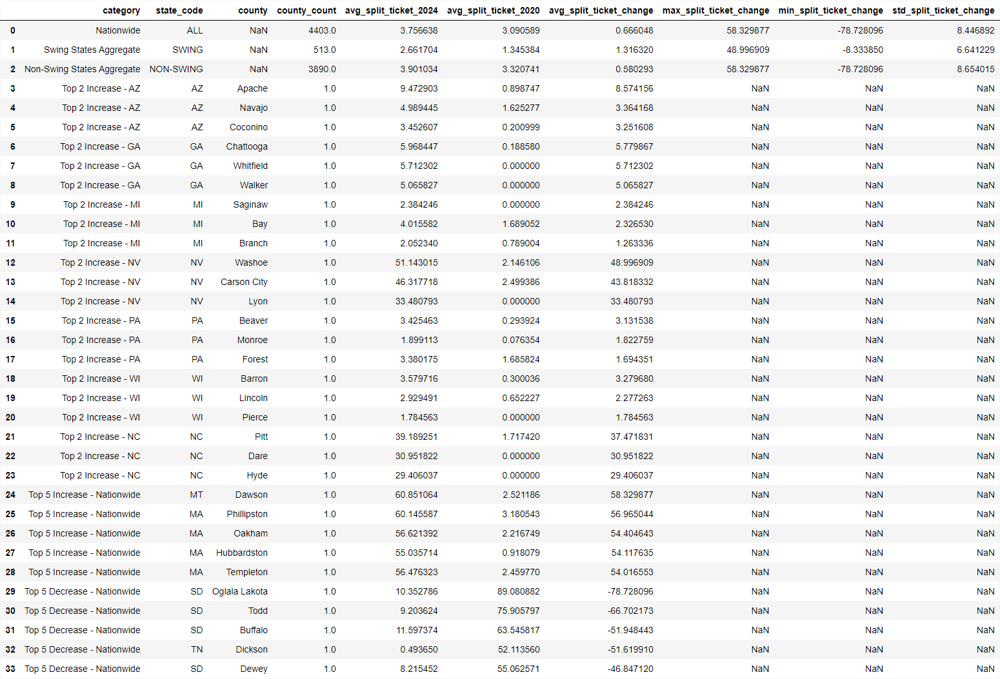

# Something Wrong? Election Analysis

## Presidential-Only Votes Increased in Swing States and Declined Elsewhere


A presidential-to-house vote ratio greater than 100% indicates more people voted in the presidential race than the House race - for example, a ratio of 103% means for every 100 House votes, there were 103 presidential votes cast in that county.


## Split-Ticket Voting Percent Increased 2x More in Swing States than in Non-Swing States


Split-ticket voting percentage for each county is calculated by taking the difference between the number of people who voted in both races (estimated as the minimum of total presidential and house votes) and the number of straight-ticket voters (estimated as the sum of the minimum number of Democratic and Republican votes across both races), divided by the total number of two-race voters and expressed as a percentage.

## Data
### Presidential-Only Votes


### Split-Ticket Votes



## Code Example
```python
import dataframe_image as dfi
from data_model import (
    ElectionDataMap, 
    ElectionYearStateCountyDistrictMap, 
    ElectionDataFullModel, 
    ElectionDataGroupedRowModel, 
    ElectionDataGroupedModel, 
    ElectionDataGroupedAndFlattenedRowModel, 
    ElectionDataGroupedAndFlattenedModel
)
from data_functions import DataFunctions
from data_analytics import DataAnalytics


## LOAD DATA (uncomment out lines to update cached file data)

years = ElectionDataMap.election_years
us_states = ElectionDataMap.election_states.keys()

#data_map = DataFunctions.get_election_year_state_district_county_map(years, us_states)
#data_map.save_to_json(["data", "election_year_state_county_district_map.json"])
data_map = ElectionYearStateCountyDistrictMap.load_from_json(["data", "election_year_state_county_district_map.json"])

#election_data = DataFunctions.get_all_election_data(ElectionDataMap.election_types.keys(), data_map)
#election_data.save_to_json(["data", "election_data_full.json"])
election_data = ElectionDataFullModel.load_from_json(["data", "election_data_full.json"])

#gropuped_election_data = DataFunctions.aggregate_full_data_to_grouped(election_data)
#gropuped_election_data.save_to_csv(["data", "election_data_grouped.csv"])
gropuped_election_data = ElectionDataGroupedModel.load_from_csv(["data", "election_data_grouped.csv"])

#flattened_election_data = DataFunctions.flatten_grouped_election_data(gropuped_election_data)
#flattened_election_data.save_to_csv(["data", "election_data_grouped_and_flattened.csv"])
flattened_election_data = ElectionDataGroupedAndFlattenedModel.load_from_csv(["data", "election_data_grouped_and_flattened.csv"])


## ANALYICS

analytics = DataAnalytics(flattened_election_data)

# Presidential-only votes
ratio_analysis = analytics.analyze_presidential_house_ratios_comprehensive()
DataAnalytics.plot_comparison_bar_chart(
    non_swing_2020=ratio_analysis["avg_ratio_2020"][2],
    non_swing_2024=ratio_analysis["avg_ratio_2024"][2],
    swing_2020=ratio_analysis["avg_ratio_2020"][1],
    swing_2024=ratio_analysis["avg_ratio_2024"][1],
    title='Average Presidential-to-House Vote Ratio',
    #subtitle='Ratio of total Presidential votes cast to total House votes cast (avg of county data)',
    #y_label='Average Ratio',
    y_bounds=(75, 125),
    figsize=(5,5),
    save_path=['images', 'ratio_analysis.png']
)
dfi.export(ratio_analysis, 'images/ratio_analysis_data.png')
# ratio_analysis.head(30)

# Split ticket votes
split_ticket_analysis = analytics.analyze_split_ticket_voting_comprehensive()
DataAnalytics.plot_comparison_bar_chart(
    non_swing_2020=split_ticket_analysis["avg_split_ticket_2020"][2]*0.01,
    non_swing_2024=split_ticket_analysis["avg_split_ticket_2024"][2]*0.01,
    swing_2020=split_ticket_analysis["avg_split_ticket_2020"][1]*0.01,
    swing_2024=split_ticket_analysis["avg_split_ticket_2024"][1]*0.01,
    title='Average Split-Ticket Voting Percent (Estimate)',
    #subtitle='Estimated by assuming voters cast straight-party ballots when possible, with any remaining votes considered split tickets.',
    #y_label='Average Ratio',
    figsize=(5,5),
    save_path=['images', 'split_ticket_analysis.png']
)
dfi.export(split_ticket_analysis, 'images/split_ticket_analysis_data.png')
# split_ticket_analysis.head(30)

```
## Source

CNN election results API.

https://politics.api.cnn.io/results/